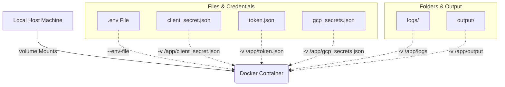

# 🐳 Docker Setup Guide

This guide walks you through building, configuring, and running the content automation pipeline inside a Docker container.

---

## 🏗️ Docker Architecture Overview

Running the application in Docker ensures a consistent environment with all necessary system dependencies (like `ffmpeg`, Python 3.11, and graphics libraries for OpenCV) pre-installed. 



---

## 🛠️ Step 1: Prerequisites

Make sure you have Docker installed and running on your system:
*   [Docker Desktop for Windows/macOS](https://www.docker.com/products/docker-desktop/)
*   Docker Engine for Linux

---

## 📦 Step 2: Build the Docker Image

Navigate to the project root directory and run the following command to build the image:

```bash
docker build -t content-automation .
```

This will:
1. Use `python:3.11-slim` as the base image.
2. Install system build dependencies, `ffmpeg`, and OpenGL/GLib runtime libraries.
3. Upgrade `pip` and install all Python dependencies from `requirements.txt`.
4. Copy the application source code into `/app`.

---

## ⚙️ Step 3: Configure Environment Variables

Create or edit your `.env` file in the project root. For running in Docker, there are two key environment variables you can configure:

*   `IS_DOCKER`: Set this to `true` inside the environment or command line so that the container stays alive (sleeps) after completing the orchestrator execution.
*   `SLEEP_TIME_DOCKER`: Duration in seconds to sleep. Default is `18000` (5 hours).

Example snippet inside `.env`:
```env
IS_DOCKER=true
SLEEP_TIME_DOCKER=18000
```

---

## 🚀 Step 4: Run the Docker Container

To run the container, you must mount the required configuration files and credentials (e.g., API keys, OAuth tokens) from your host machine into the container workspace `/app`. You should also mount the `output/` and `logs/` directories to persist the generated media files and log details.

Choose the command matching your shell/operating system:

### 🐚 Option A: Linux / macOS (Bash / Zsh)
```bash
docker run -d \
  --name content-automation-runner \
  --env-file .env \
  -v "$(pwd)/client_secret.json:/app/client_secret.json" \
  -v "$(pwd)/token.json:/app/token.json" \
  -v "$(pwd)/gcp_secrets.json:/app/gcp_secrets.json" \
  -v "$(pwd)/output:/app/output" \
  -v "$(pwd)/logs:/app/logs" \
  content-automation
```

### 🟦 Option B: Windows (PowerShell)
```powershell
docker run -d `
  --name content-automation-runner `
  --env-file .env `
  -v "${PWD}/client_secret.json:/app/client_secret.json" `
  -v "${PWD}/token.json:/app/token.json" `
  -v "${PWD}/gcp_secrets.json:/app/gcp_secrets.json" `
  -v "${PWD}/output:/app/output" `
  -v "${PWD}/logs:/app/logs" `
  content-automation
```

### 🟥 Option C: Windows (Command Prompt - CMD)
```cmd
docker run -d ^
  --name content-automation-runner ^
  --env-file .env ^
  -v "%cd%/client_secret.json:/app/client_secret.json" ^
  -v "%cd%/token.json:/app/token.json" ^
  -v "%cd%/gcp_secrets.json:/app/gcp_secrets.json" ^
  -v "%cd%/output:/app/output" ^
  -v "%cd%/logs:/app/logs" ^
  content-automation
```

> [!IMPORTANT]
> If any credential file (like `token.json` or `gcp_secrets.json`) is not yet generated on your host system before running the docker command, Docker might create a directory with that name on the host. Make sure all credential files exist (even as empty files) before running the `docker run` command with direct file-to-file mounts.

---

## 🔍 Step 5: Check Logs and Verification

To check the execution status and output logs of the running container:

```bash
docker logs -f content-automation-runner
```

To stop the container:
```bash
docker stop content-automation-runner
```

To remove the container:
```bash
docker rm content-automation-runner
```
