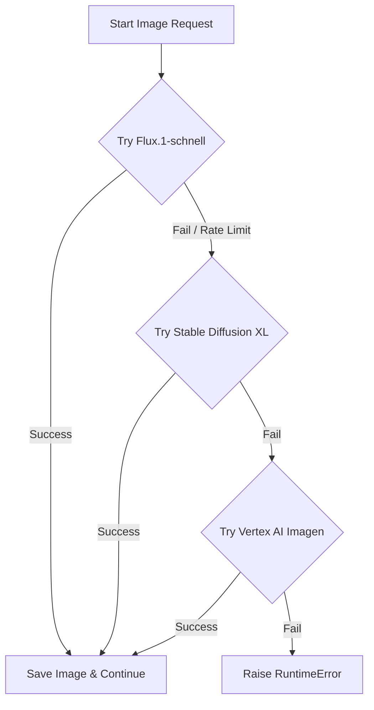

# 🔑 Hugging Face Token Setup Guide

This guide describes how to acquire a Hugging Face Access Token to run serverless image generation models like Flux and Stable Diffusion (SDXL) for your automated posts.

---

## 🎨 Image Generation Architecture

To avoid running heavy machine learning weights (which require expensive local GPUs or VM instances), this pipeline uses the **Hugging Face Serverless Inference API**. This sends text prompts to Hugging Face's hosted instances and returns high-resolution images in seconds.

The image generation components (`Piepline/imagePipeline.py` and `Piepline/VideoPipeline.py`) utilize a multi-layered fallback strategy:



---

## 🛠️ Step 1: Create a Hugging Face Account

1.  Go to the [Hugging Face Website](https://huggingface.co/).
2.  Click **Sign Up** in the top-right corner.
3.  Follow the registration prompts to verify your email and complete account setup.

---

## 🔑 Step 2: Generate an Access Token

1.  Log into your Hugging Face account.
2.  Click on your profile picture in the top-right corner and select **Settings**.
3.  In the left sidebar, click on **Access Tokens**.
4.  Click **New token** (or **Create new token**).
5.  Set the token properties:
    *   **Token Name**: e.g., `Social Media Automation`
    *   **Token Type**: Select **Read** (This allows query access to inference endpoints, which is all the pipeline requires).
6.  Click **Generate a token**.
7.  Copy the generated token string immediately (it will start with `hf_...`).

---

## 📝 Step 3: Configure your Environment

Open your `.env` file in the root of the project and paste your token under the `HF_TOKEN` key:

```env
HF_TOKEN=
```

### ⏳ Rate Limiting Delay (Optional)
To avoid hitting Hugging Face Serverless API rate limits / concurrent requests errors when generating 5 images in rapid succession for a video, you can set the sleep time (in seconds) between generations:
```env
# Default: 5.0 seconds for Hugging Face models
IMAGE_GEN_SLEEP=5.0
```

---

## 🤖 Model Specifications

The following models are queried using the `huggingface_hub` client:

### 1. FLUX.1-schnell (`black-forest-labs/FLUX.1-schnell`)
*   **Provider**: Hugging Face Serverless Inference.
*   **Dimensions**:
    *   Single Posts: $1024 \times 1024$ (Square)
    *   Reels / Videos: $1080 \times 1920$ (Vertical)
*   **Properties**: Unrivaled detail, state-of-the-art text rendering, and composition.

### 2. Stable Diffusion XL (`stabilityai/stable-diffusion-xl-base-1.0`)
*   **Provider**: Hugging Face Serverless Inference (Fallback).
*   **Dimensions**:
    *   Single Posts: $1024 \times 1024$
    *   Reels / Videos: $1024 \times 1024$
*   **Properties**: Highly reliable art styles, cinematic rendering, and rich color composition.
